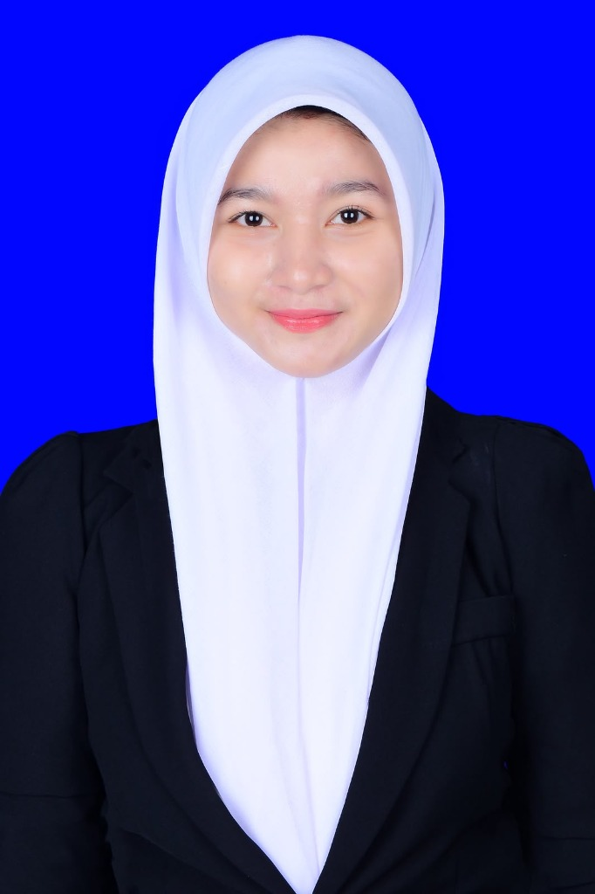
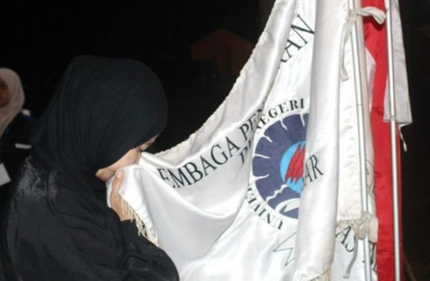
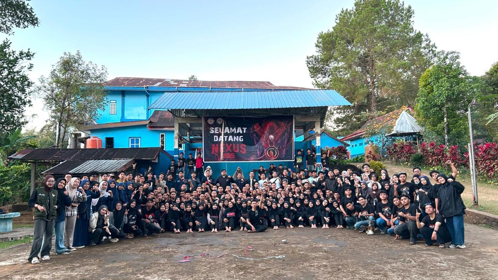
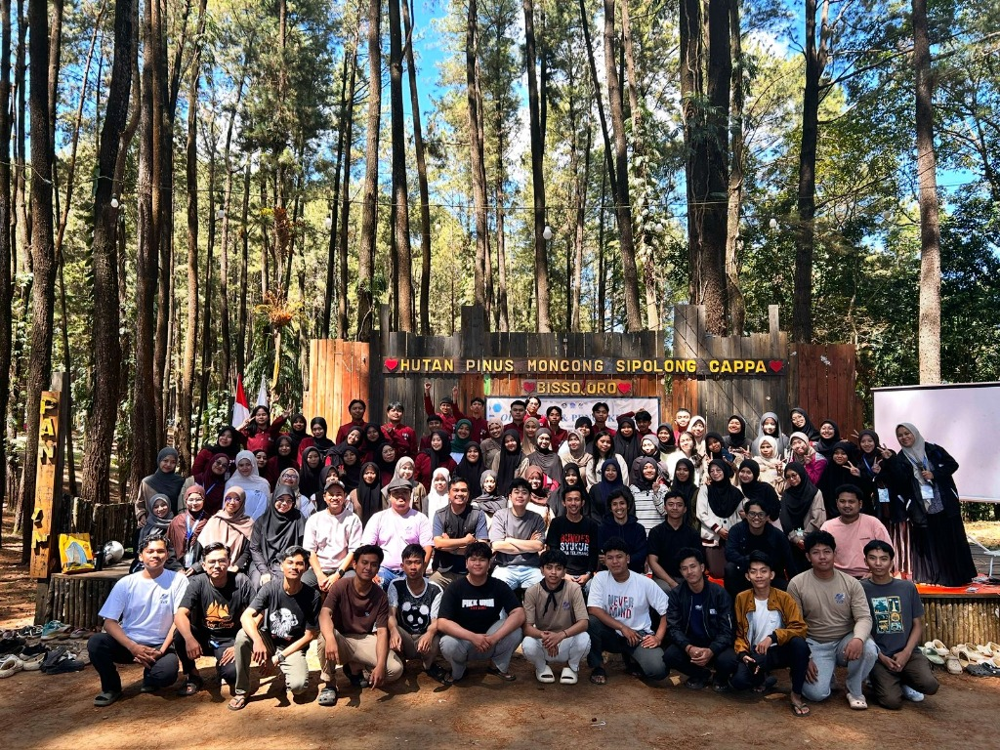
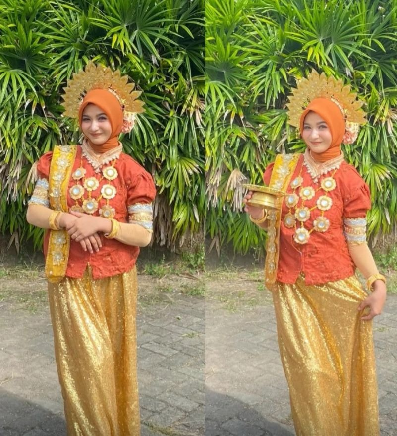
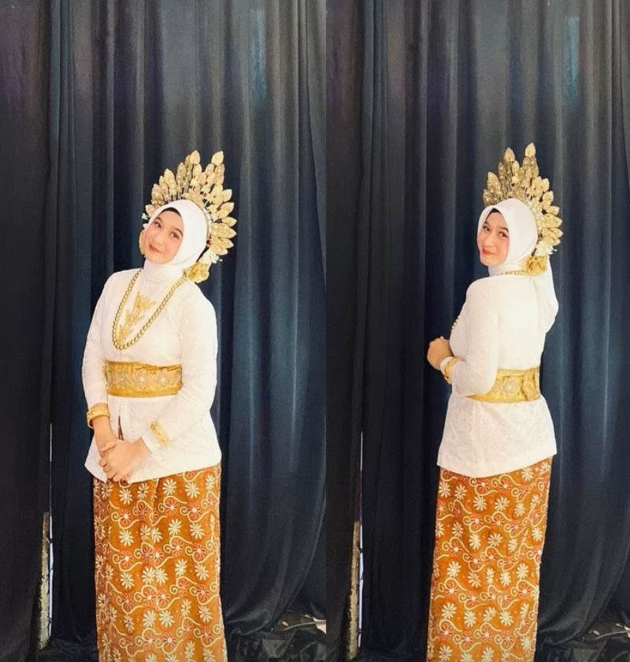
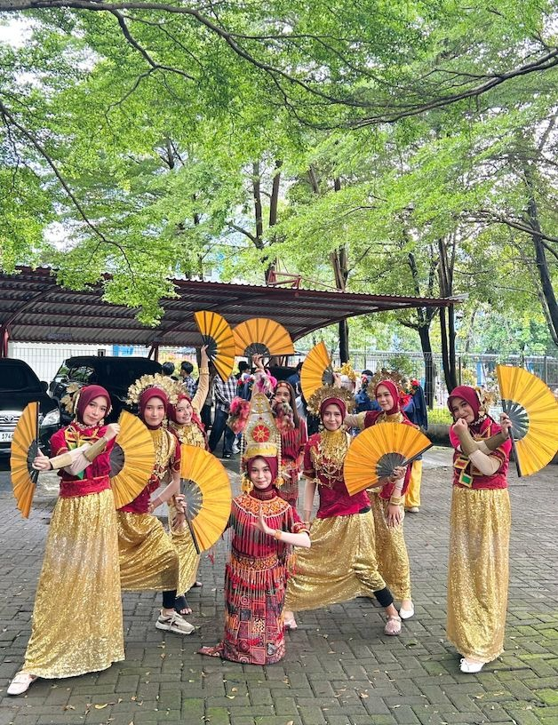
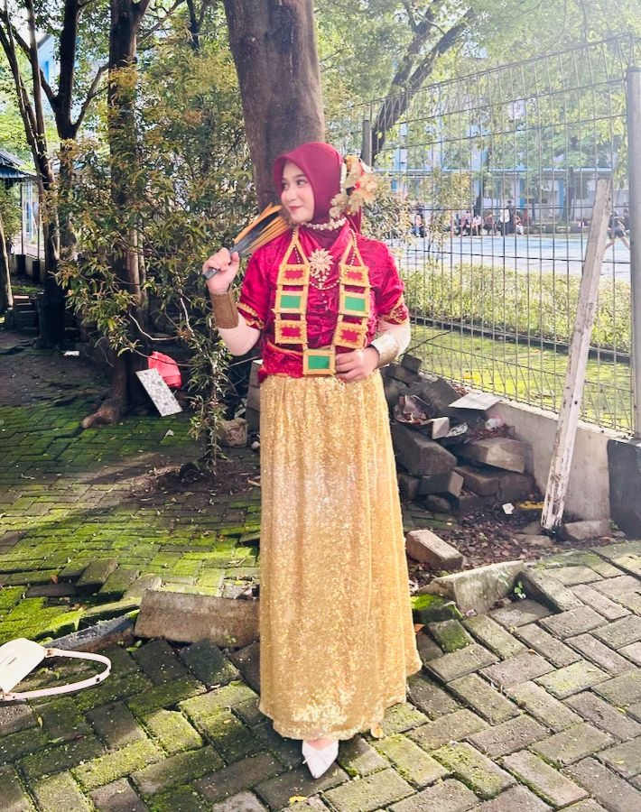
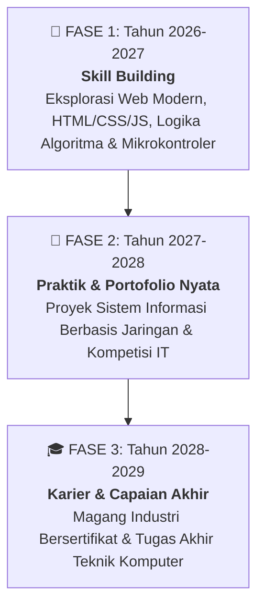

# 🔴 Portofolio Digital - Nayla Azzahra R

<div align="center">


<br>



### **Nayla Azzahra R**
**Mahasiswi Teknik Komputer (Kelas C - Angkatan 2025)**  
*Fokus Minat: Web Design, Jaringan Komputer & IoT | Pegiat Seni Tari Tradisional | Aktif Organisasi Mahasiswa*

🌐 **Website Live URL**: **[https://naylaazzahrah358-beep.github.io](https://naylaazzahrah358-beep.github.io)**

</div>

---

## 📌 Profil & Biodata Diri

| Informasi | Keterangan |
| :--- | :--- |
| **Nama Lengkap** | **Nayla Azzahra R** |
| **Program Studi** | **Teknik Komputer (Kelas C - Angkatan 2025)** |
| **Mata Kuliah** | **Praktikum Pemrograman Web** |
| **Fokus Minat** | **Web Design, Jaringan Komputer & Internet of Things (IoT)** |
| **Hobi Utama** | **Seni Tari Tradisional Nusantara (Traditional Dance)** |
| **Organisasi** | **LPM Penalaran UNM & Anggota Formal JTIK (NEXUS 2025)** |
| **Platform Koding**| HTML5, CSS3, Visual Studio Code, Git, GitHub Pages |

---

## 💻 Proyek Aplikasi: mencraft.id

<div align="center">
    
</div>

> **mencraft.id** adalah aplikasi sederhana untuk mempermudah pemesanan bucket. Saya membuatnya menggunakan **Python** sebagai salah satu proyek untuk belajar membuat aplikasi.

### ✨ Fitur Utama mencraft.id:
1. **Pilih Bucket**: Memilih jenis bucket yang tersedia beserta harga melalui menu pilihan.
2. **Tambah Pesanan**: Menambahkan bucket ke daftar pesanan dan menentukan jumlah yang ingin dipesan.
3. **Kelola Pesanan**: Mengubah atau menghapus pesanan yang sudah dimasukkan ke dalam daftar.
4. **Checkout**: Menyelesaikan transaksi dan menyimpan riwayat pesanan ke dalam file JSON.

---

## 👥 Pengalaman Organisasi Mahasiswa

Aktif mengembangkan kapasitas diri, kepemimpinan, daya nalar ilmiah, serta memperluas relasi melalui keikutsertaan dalam organisasi kemahasiswaan:

| Dokumentasi | Organisasi & Peran | Deskripsi Kegiatan |
| :---: | :--- | :--- |
|  | **LPM Penalaran UNM**<br>*(Lembaga Penalaran & Riset Ilmiah Tingkat Universitas)* | Wadah pengembangan pola pikir kritis, riset akademis, karya tulis ilmiah, dan penalaran mahasiswa di tingkat Universitas Negeri Makassar guna mengasah kapasitas intelektual dan kepemimpinan. |
|  | **Anggota Formal JTIK (NEXUS 2025)**<br>*(Lembaga Kemahasiswaan Jurusan Teknik Informatika & Komputer FT-UNM)* | Menjadi bagian dari keluarga besar mahasiswa JTIK FT-UNM, aktif mempererat solidaritas angkatan NEXUS 2025, kolaborasi dalam kegiatan teknologi, dan pembentukan relasi profesional. |
|  | **Pengembangan Karakter & Kepemimpinan**<br>*(Pelatihan Karakter & Kepemimpinan di Alam Terbuka)* | Mengikuti program pelatihan kepemimpinan luar ruang di Hutan Pinus Moncong Sipolong Cappa Bissooro guna membentuk ketangguhan mental, adaptabilitas, serta komunikasi efektif dalam tim organisasi. |

---

## 🎭 Hobi: Seni Tari Tradisional Nusantara

Bagi saya, seni tari tradisional adalah media pelestarian budaya luhur bangsa, mengasah kedisiplinan gerak, keanggunan, serta melatih harmonisasi ritme yang melengkapi pola pikir analitis dalam dunia teknologi:

| <br>**Tari Busana Emas** | <br>**Tari Kebaya & Mahkota** | <br>**Pementasan Tari Kipas Tim** | <br>**Tari Kipas Merah Emas** |
| :---: | :---: | :---: | :---: |
| *Pose anggun dengan hiasan kepala mahkota adat berkilau emas khas Nusantara.* | *Perpaduan kebaya putih modern dan batik ornamen emas yang elegan.* | *Formasi pementasan tari kipas berkelompok yang kompak, dinamis, dan selaras.* | *Penampilan penuh semangat dengan kostum merah-emas dan properti kipas.* |

---

## 🎯 Target & Peta Rencana 2–3 Tahun Kedepan



- **Fase 1: Tahun 2026–2027 (Skill Building)**
  - *Eksplorasi Teknologi Web & Arsitektur Komputer*: Mendalami teknologi web modern secara mendalam (HTML, CSS, JavaScript, serta framework modern) dan memperkuat pemahaman logika algoritma pemrograman serta sistem mikrokontroler.
- **Fase 2: Tahun 2027–2028 (Praktik & Portofolio Nyata)**
  - *Implementasi Proyek & Kompetisi IT*: Membangun proyek sistem informasi berbasis jaringan komputer dan aktif mengikuti kompetisi di bidang IT untuk memperluas portofolio praktis dan jejaring kerja sama tim.
- **Fase 3: Tahun 2028–2029 (Karier & Capaian Akhir)**
  - *Magang Industri & Penyelesaian Tugas Akhir*: Mengikuti program magang industri bersertifikat di perusahaan dan menyelesaikan tugas akhir Teknik Komputer yang inovatif serta berdampak nyata bagi masyarakat luas.

---

## 🌐 3 Pilar Fokus Minat Keilmuan

1. **Web Design**: Menguasai perancangan antarmuka pengguna (UI/UX), styling visual estetis (CSS3), tata letak responsif multi-perangkat, dan kemudahan akses.
2. **Jaringan Komputer**: Mempelajari arsitektur jaringan komputer, protokol komunikasi data, routing & switching, serta pengelolaan hosting dan server web.
3. **Internet of Things (IoT)**: Mengeksplorasi integrasi mikrokontroler, pemrograman sensor cerdas, dan komunikasi data untuk sistem otomasi cerdas.

---

## 💻 Penerapan Konsep Modul Praktikum Web

- **Modul 3 (CSS Dasar)**: Selector HTML, Selector Class, Selector ID, Grouping Selector, serta CSS Inline, Internal, & Eksternal.
- **Modul 4 (CSS Image & Background)**: Border gambar, manipulasi dimensi (Width & Height), background gradient, serta transparansi gambar (Opacity & Hover effect).
- **Modul 5 (Layouting CSS)**: Navigasi horisontal, navigasi vertikal, struktur tata letak 2 kolom (`#leftcolumn` & `#rightcolumn`), dan 3 kolom sejajar (`#sidebar-kiri`, `#sidebar-tengah-atau-badan`, `#sidebar-kanan`).
- **Modul 6 (Navigasi Dropdown)**: Menu navigasi bertingkat dengan linear gradient, efek transisi halus, border-radius, dan alignment dropdown.

---

## 📂 Struktur File Repositori

```text
naylaazzahrah358-beep.github.io/
├── index.html            # Halaman utama (Beranda Cover, Profil, Target 2-3 Tahun, Fokus Minat, Hobi & Organisasi)
├── about.html            # Halaman biodata lengkap, latar belakang, hobi & pengalaman organisasi
├── contact.html          # Halaman formulir kontak & saluran komunikasi
├── style.css             # Stylesheet utama (Black, White & Red Theme & Kaidah CSS Modul 3-6)
├── foto-profil.jpg       # Foto profil utama
├── foto-organisasi-1.jpg # Dokumentasi Kegiatan Kepemimpinan Luar Ruang
├── foto-organisasi-2.jpg # Dokumentasi Pelantikan Riset LPM Penalaran UNM
├── foto-organisasi-3.jpg # Dokumentasi Temu NEXUS 2025 JTIK FT-UNM
├── foto-tari-1.jpg       # Dokumentasi Tari Tradisional Busana Emas
├── foto-tari-2.jpg       # Dokumentasi Tari Kebaya Putih & Batik
├── foto-tari-3.jpg       # Dokumentasi Pementasan Tari Kipas Kelompok
├── foto-tari-4.jpg       # Dokumentasi Tari Kipas Merah Emas
├── mencraft-logo.jpg     # Logo Proyek Aplikasi MenCraft.id
└── README.md             # Dokumentasi visual resmi repositori
```

---

## 📬 Kontak & Komunikasi

- **GitHub**: [@naylaazzahrah358-beep](https://github.com/naylaazzahrah358-beep)
- **Email**: [naylaazzahrah358@gmail.com](mailto:naylaazzahrah358@gmail.com)
- **WhatsApp**: 085705952172
- **Website Live**: [https://naylaazzahrah358-beep.github.io](https://naylaazzahrah358-beep.github.io)
